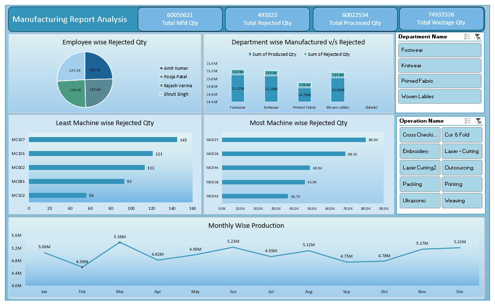
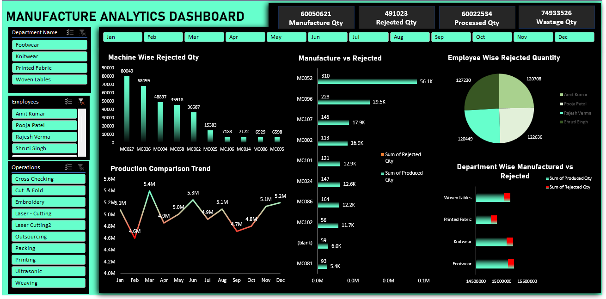

# 🏭 Manufacturing Analysis Dashboard

## 📘 Project Overview  
The **Manufacturing Analysis Dashboard** project focuses on analyzing production performance using **Excel**, **Power BI**, and **SQL**.  
It visualizes key manufacturing metrics to identify efficiency, rejection patterns, and departmental performance.  
Data was imported from a CSV source (`Manufacturing Data`) and analyzed across multiple tools to gain comprehensive insights.

---

## 🧰 Tools & Technologies Used  
- **Microsoft Excel** — Data cleaning and dashboard creation  
- **Power BI** — Advanced visualization and KPI analysis using DAX measures  
- **SQL** — Querying, filtering, and data preparation  

---

## ⚙️ Key Features & Metrics  
The dashboards include critical KPIs and analytical visuals such as:  

- 📦 **Manufacture Quantity** — Total products manufactured  
- ❌ **Rejected Quantity** — Total products rejected  
- ⚙️ **Processed Quantity** — Successfully processed units  
- 🗑️ **Wastage Quantity** — Total manufacturing wastage  
- 🏭 **Machine-Wise Rejected Quantity** — Highlights machines with higher rejection rates  
- 👷 **Employee-Wise Rejected Quantity** — Tracks rejection per employee  
- 🏢 **Department-Wise Manufactured vs Rejected** — Compares departmental performance  
- 📈 **Production Comparison Trend** — Monthly production performance  
- ⚖️ **Manufacture vs Rejected** — Ratio of total produced vs total rejected  

---

## 📊 Dataset Details  
- **Dataset Name:** `Manufacturing Data`  
- **Source:** CSV file (`Manufacturing_Data.csv`)  
- **Attributes Include:**  
  - Machine ID  
  - Employee Name  
  - Department  
  - Manufacture Qty  
  - Rejected Qty  
  - Processed Qty  
  - Month / Date  

---

## 💡 Insights & Outcomes  
- Identified **top-performing departments** and **machines with the lowest rejection rates**  
- Detected **high rejection patterns** among specific employees and machines  
- Enhanced **production tracking** and **quality control visibility**  
- Created **cross-tool performance comparisons** using Power BI, Excel, and SQL  

---

## 👩‍💻 Role & Contributions  
**Individual Project** — handled all aspects including:  
- Data import, cleaning, and transformation (SQL, Excel)  
- Dashboard creation in **Excel** and **Power BI**  
- Developed **KPIs**, **DAX measures**, and **interactive slicers/filters** for visualization  

---

## 🖼️ Project Visuals  

### 📊 Excel Dashboards  

  

  

### 📈 Power BI Dashboard  

  

---

## ⚙️ How to Reproduce / View Project
Follow the steps below to open and explore the project across tools:

### Excel
1. Open `Excel_Dashboard_Project(1).xlsx` or `Excel_Dashboard_Project(2).xlsx` in **Microsoft Excel**.  
2. Review pivot charts, slicers, and key KPI visualizations.

### Power BI
1. Open `PowerBI Manufacture Analytics.pbix` in **Power BI Desktop**.  
2. Check data source links (ensure `Manufacturing_Data.csv` is in the same folder).  
3. Refresh data to load the visuals and DAX measures.

### SQL
1. Open `Sql_Project.sql` in **SQL Server Management Studio (SSMS)** or any SQL client.  
2. Execute the queries to analyze production data and validate KPIs used across dashboards.

---

## 📂 Project Files  
- `Manufacturing Data.csv` — Dataset used for all tools  
- `Excel_Dashboard_Project(1).xlsx` — Excel dashboard 1  
- `Excel_Dashboard_Project(2).xlsx` — Excel dashboard 2  
- `PowerBI Manufacture Analytics.pbix` — Power BI project  
- `Sql_Project.sql` — SQL query script  
- `Images/` — Folder containing all dashboard screenshots  

---

## 🏆 Key Takeaways  
This project demonstrates an **end-to-end manufacturing analytics workflow** across multiple BI tools.  
It highlights how data-driven dashboards can enhance **decision-making**, **reduce wastage**, and **optimize production efficiency** in manufacturing environments.

---

## 👤 Author  
**Madan N** — Data Analyst  
📧 madan23112002@gmail.com  
💼 [LinkedIn](https://www.linkedin.com/in/madan-n-4a1a80327/)

---

*Note: This project is created for learning and analytical demonstration purposes.*
